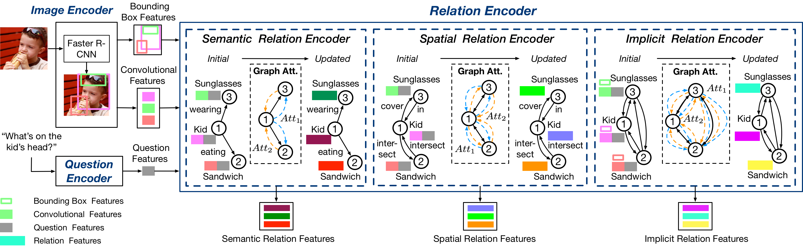

# Relation-aware Graph Attention Network for Visual Question Answering

This repository is the implementation of [Relation-aware Graph Attention Network for Visual Question Answering](https://arxiv.org/abs/1903.12314).



This repository is based on and inspired by @hengyuan-hu's [work](https://github.com/hengyuan-hu/bottom-up-attention-vqa) and @Jin-Hwa Kim's [work](https://github.com/jnhwkim/ban-vqa). We sincerely thank for their sharing of the codes.

## Prerequisites

You may need a machine with 4 GPUs with 16GB memory each, and PyTorch v1.0.1 for Python 3.

1. Install [PyTorch](http://pytorch.org/) with CUDA10.0 and Python 3.7.
2. Install [h5py](http://docs.h5py.org/en/latest/build.html).
3. Install [block.bootstrap.pytorch](https://github.com/Cadene/block.bootstrap.pytorch).

## Data

Our implementation uses the pretrained features from [bottom-up-attention](https://github.com/peteanderson80/bottom-up-attention), the adaptive 10-100 features per image. In addition to this, the GloVe vectors and Visual Genome question answer pairs. For your convenience, the below script helps you to download preprocessed data.

## Training and Evaluating

```bash
python .\main_modify.py --config config/butd_vqa.json
```

## Citation

```text
@article{li2019relation,
  title={Relation-aware Graph Attention Network for Visual Question Answering},
  author={Li, Linjie and Gan, Zhe and Cheng, Yu and Liu, Jingjing},
  journal={ICCV},
  year={2019}
}
```

## License

MIT License
